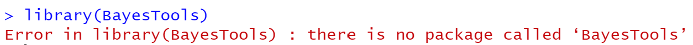
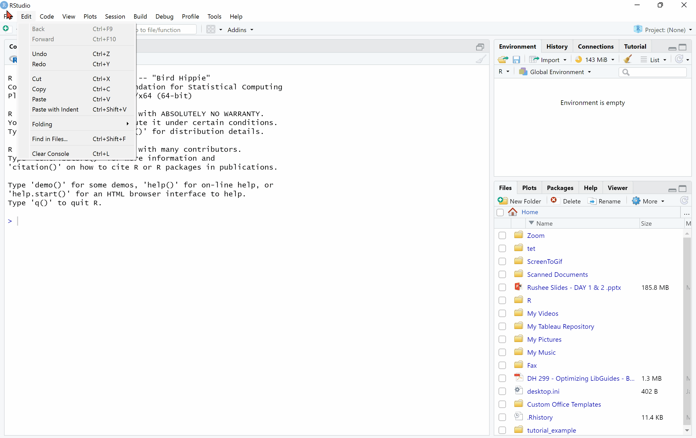
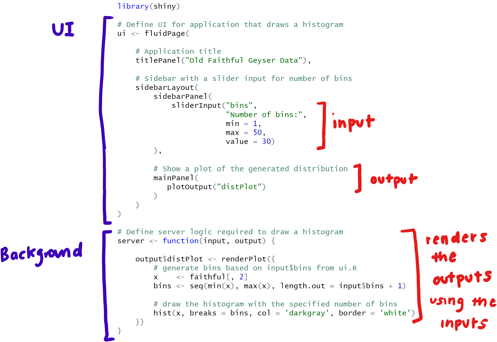
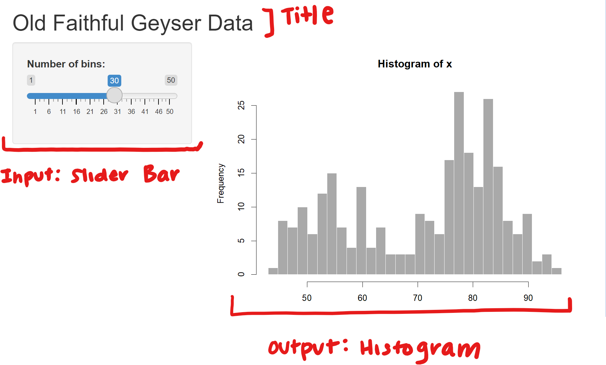
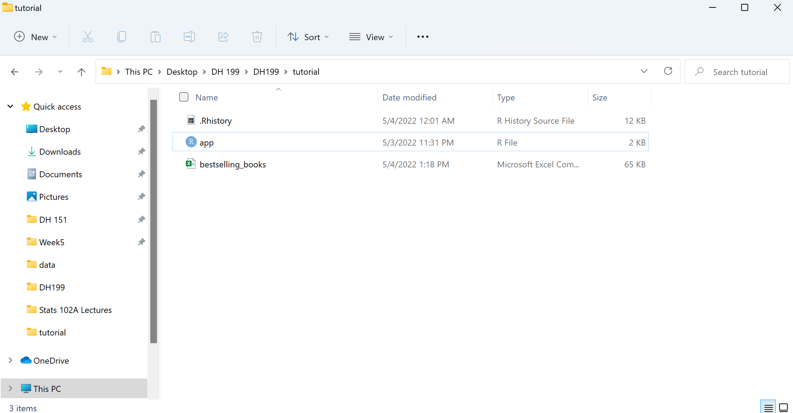
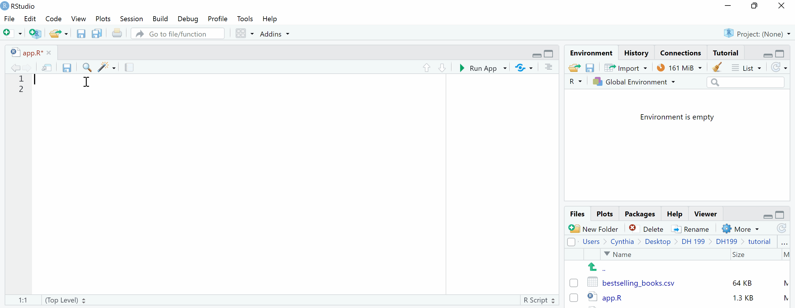
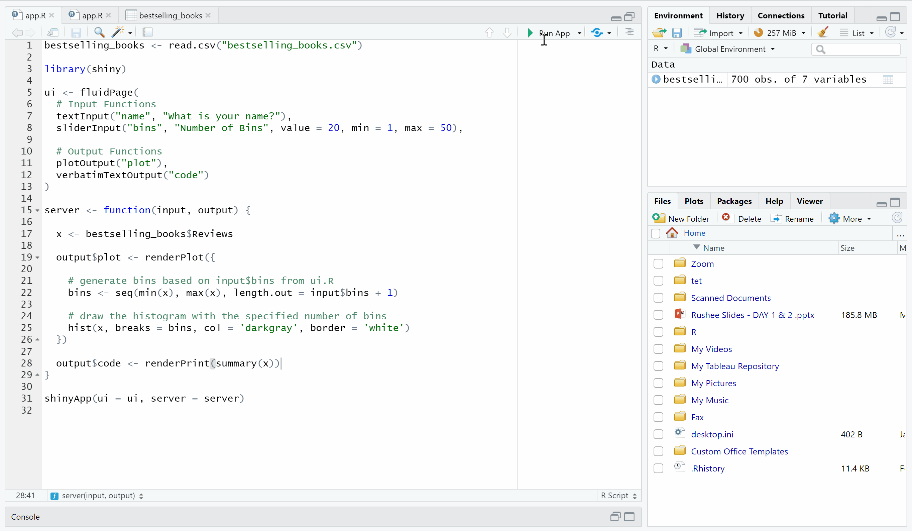
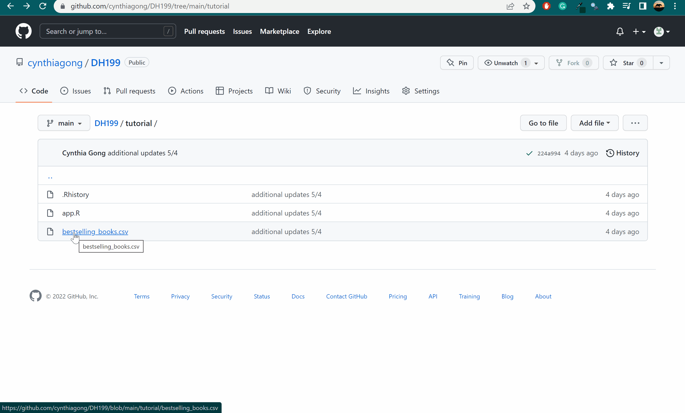
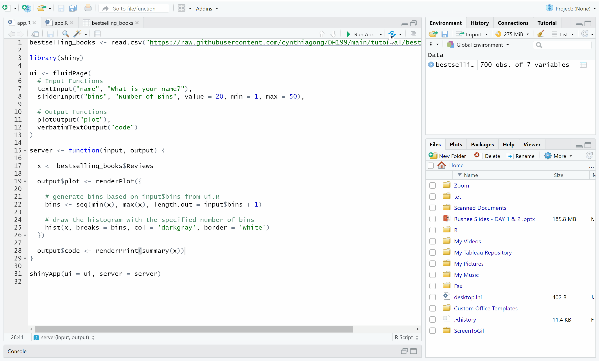

# **Creating A Basic Shiny Web App**
### **Goal**: Publish an interactive web app to effectively visualize and analyze datasets common to academia. Suitable for users familiar with basic coding in R. 

### **Time**: 2 Hours

### **Files Used in Examples**: [Link](https://github.com/cynthiagong/DH199/tree/main/tutorial)

***

## Table of Contents
1. [Getting Started](#getting-started)
    + [Things to Download](#things-to-download)
    + [Setting Up Directory](#setting-up-directory)
    + [Setting Up R Environment](#setting-up-r-environment)
2. [Web App Set-Up](#set-up)
    + [Creating the Skeleton](#creating-the-skeleton)
    + [Understanding the Structure](#understanding-the-structure)
    + [Choosing and Uploading Your Data](#data) 
3. [Building the Web App](#building-the-web-app)
    + [Customizing Your Front-End](#customizing-ui)
        + [Different Types of Inputs](inputs.md) 
        + [Different Types of Outputs](outputs.md)
    + [Coding the Back-End](#coding-the-back-end)
      + [Displaying Reactive Output](#displaying-reactive-output)
    + [Completing the App](#completing-the-app)
    + [Publish Your Web App Online](#publishing-web-app)
4. [Additional Components](#additional-components)
  + [Changing the Layout](#changing-layout)
  + [Additional Web App Content](#additional-content)
5. [Advanced Features](#advanced-features)

*** 

## **Why use Shiny?**
Shiny is a framework for creating web applications using R code. Since Shiny is entirely based in R, users don't need front-end web dev knowledge to develop a complex app. Rather, with just a few lines of code, Shiny transforms your data into interactive charts and graphics with toggleable filters on a clean-looking website. 

The specific purpose of this tutorial is to leverage the power of Shiny to allow students and researchers to transform their simple findings into rich websites that displays data in a more interactive and accesible format.

Check out this [gallery](https://shiny.rstudio.com/gallery/) for some ideas of what Shiny can help you create! 

## **Getting Started:** <a id="getting-started"></a>
### Things to Download: <a id="things-to-download"></a>
As a refresher, the following will be needed to code with R and use the Shiny package:
+ [R](https://cran.r-project.org/bin/windows/base/)
+ [RStudio](https://www.rstudio.com/products/rstudio/download/)

### Setting Up the Directory <a id="setting-up-directory"></a>
Next step is to set a working directory to store all your web app files in. 

First, create a new folder and give it a specific name; the location of the folder does not matter as long as you remember its file path.

Next, in RStudio, go to **Session > Set Working Directory > Choose Directory** and select the folder you just created. You can also use the function **setwd()**.

```
setwd("/path/to/directory")

#For Windows users:
setwd("c:/Documents/my/directory")
```

### Setting Up the R Environment <a id="setting-up-r-environment"></a>
After R and RStudio are succesfully installed, open up your RStudio console to install Shiny. Type in the following code line into the command line on the console:

```
install.packages("shiny")
```

In addition to Shiny, there may be other packages you might need to install as we progress with the tutorial. RStudio will send a warning if your packages aren't up-to-date and specify the exact ones that need to be installed.



You can install these packages following the same syntax as below, but replace *packages* with the name of the actual package in paratheses.

```
install.packages("packages")
```

## **Web App Set-Up** <a id="set-up"></a>

### Creating the Skeleton for the Web App <a id="creating-the-skeleton"></a>
After Shiny is succesfully installed, there are two approaches in creating the base structure of your webapp. The easiest option is to go to **File > New File > Shiny Web App**. When the pop-up appears, type in a name for your file and press "create". Congrats!! You just created your first Shiny Web App.



The second approach can be found [here](https://mastering-shiny.org/basic-app.html#create-app).

### Understanding the Structure <a id="understanding-the-structure"></a>
There are two core components to the code of a Shiny Web App; the UI component and the background or server component. The sample Shiny Web App code RStudio provides highlights the differences between these sections. 



**UI Component**: Code in the UI section dictates what will be visually displayed when the web app is loaded. The UI component consists of two important elements - the inputs and the outputs. These additional elements state the types of interactive inputs that will be present as well as the types of graphical outputs that will be generated.

For instance, in our sample code our input is a slider bar that allows us to adjust the bin width of a bar plot, while the output is the bar plot. We see these elements when we run the code:



We will cover additional types of inputs and outputs later on in this tutorial. Or if you would like, click [here]() to jump straight to that section!

**Server Component**: This portion of the code renders the data based off the specific inputs as well as the desired outputs stated in the UI section. Likewise, additional functions can be called to assign elements to outputs that appear in the user interface.

In the example provided by RStudio, the server-side code is where we state the dataset we will be utilizing, partition the specified data based on inputted bin widths, and then generate the histogram that will be displayed as the output. 

Now that we have a basic understanding of how the code in a Shiny Web App is structured, we will move on to customizing the web app for your own datasets.
 
Do not fear if this section doesn't make sense, as we will be going over these topics in detail a little further into the tutorial.

### Choosing and Uploading Your Data <a id="data"></a>
The goal of this tutorial is to build a customized web app that displays the analysis and findings specific to your dataset. As a result, it is important your data is compatable. 

**1. The data should be in .csv format.** Online converters such as [this one](https://cloudconvert.com/csv-converter) are availale to convert other file formats into .csv 

**2. The data should be [tidy](https://cran.r-project.org/web/packages/tidyr/vignettes/tidy-data.html).** 
+ Both rows and columns are clearly labeled
+ Every column is a variable
+ Every row is an observation
+ Every cell is a single value 

While it is not necessary that your data is tidy, tidy data provides a standard way to organize values in a dataset, which in turn makes data analysis easier. As a result I highly recommend spending some time tidying up your dataset if possible.

**UPLOADING THE DATA**

After a compatable dataset has been selected, the next step is to read the data into R. First, move the data file into your Working Directory. For this tutorial, I will be using the sample dataset "bestselling_books" and moving it to my Working Directory file "tutorial". This is the same file that contains my R code.



Then we do some coding! To read the dataset into our global code environment, we use the following line of code:

```
bestselling_books <- read.csv("bestselling_books.csv)
```

For the purposes of the tutorial, before we read in your data, clear out every single line of sample code RStudio provided in your app.R file before you proceed to the next step. This way we can start with a blank slate. 

To read in your specific data file, you would use something very similar to the code snippet provided below, but replace *filename* with the name of your file, and replace *dataname* with the name that you want to refer your file by in the code. If you didn't upload your data file into the Working Directory as recommended earlier, you will have to list your entire file path in *filename*. 

```
dataname <- read.csv("filename")
```

Hit Ctrl+Enter to run this line of code, and you will see your data file show up in the Global Environments section on the right panel! Click on it to see a preview of your data. If the panel is hidden on your screen, drag the far right side of the code panel towards the left.



Now that our data is succesfully loaded, we can move onto building our Shiny Web App.

## **Building the Web App** <a id="building-the-web-app"></a>

Start by writing the followng line of code to load the Shiny package:

```
library(shiny)
```
### Customizing Your Front-End <a id="customizing-ui"></a>

The first step of building out the front-end user interface is determining the kinds of interactive input you'd like users to have. Shiny offers a variety of input funcitons, such as sliderInput() which we saw in the sample code. 

Next, we want to determine the outputs our web app will display. 

Click below to see the different types of input and output functions and the instructions on using them! Keep this info in mind as we start putting all the code together in the next step.

> ### [**Input Functions**](inputs.md) 

> ### [**Output Functions**](outputs.md)  

<br>

**FRONT-END CODE**

Our front-end code will be wrapped with the following:
```
ui <- fluidPage(
    
)
```

For our tutorial example, I want users to have a text input and a slider input. For your own web app, you will replace the input functions I've listed with the ones you want to include. Here is the full code snippet:

```
bestselling_books <- read.csv("bestselling_books.csv")

library(shiny)

ui <- fluidPage(
  # Input Functions
  textInput("name", "What is your name?"),
  sliderInput("bins", "Number of Bins", value = 20, min = 1, max = 50),
)
```

Likewise, the outputs I'd like to include in my example will be a plot and a console output. After adding my output functions, my code now looks like:

```
bestselling_books <- read.csv("bestselling_books.csv")

library(shiny)

ui <- fluidPage(
  # Input Functions
  textInput("name", "What is your name?"),
  sliderInput("bins", "Number of Bins", value = 20, min = 1, max = 50),
  
  # Output Functions
  plotOutput("plot"),
  verbatimTextOutput("code")
)
```

Once we have our front-end code finalized, it is time to write our back-end server funcion.

### Coding the Back-End <a id="coding-the-back-end"></a>

As mentioned in the previous section, each ```output``` function on the front end is paired with a ```render``` function in the back end. We will learn how to constuct the server function that connects everything in this section. 

The skeleton of the ```server``` function looks like this:

```
server <- function(input, output) {

}
```
The ```render``` functions are nested within the  ```server``` function. A new ```render``` function will be called for every single  ```output``` function called earlier. Furthermore, there are different types of ```render``` functions that correspond with the different types of objects you want the code to render. 

| **Render Function** | **Output Function** | **Comments** |
|---|---|---|
| ```renderText()``` | ```textOutput()``` | Combines results into a single string |
| ```renderPrint()``` | ```verbatimTextOutput()``` | Prints the result as if you were in an R console |
| ```renderTable()``` | ```tableOutput()``` | Renders a static table of data, showing all data at once |
| ```renderDataTable()``` | ```dataTableOutput()``` | Renders a dynamic table with controls to show which rows are visible  |
| ```renderPlot``` | ```plotOutput()``` | Displays any type of R graphic |


**BACK-END CODE** 

To get a better understanding, let's walk through these steps with the example we have been working on. 

In our example, we had two output functions: ```plotOutput()``` and ```verbatimTextOutput()```. As a result, we need to write two ```render``` functions. 

Our first ```render``` function will be paired with the ```plotOutput()``` function. We want to render a plot, so we use ```renderPlot()```. Our second ```render``` function will be paired with ```verbatimTextOutput()```; since a console output needs to be rendered, we call ```renderPrint()```.

When writing the code, you call the output function by name and assign the ```render``` function to it. The name of the output function is the first argument in the function. For instance, ```plotOutput("plot")``` will be called using ```output$plot```. The server function for our example looks like:

```
server <- function(input, output) {
  output$plot <- renderPlot({
    x <- bestselling_books$Reviews
    
    # generate bins based on input$bins from ui.R
    bins <- seq(min(x), max(x), length.out = input$bins + 1)
    
    # draw the histogram with the specified number of bins
    hist(x, breaks = bins, col = 'darkgray', border = 'white')
  })
  
  output$code <- renderPrint(summary(x))
}
```

**NOTE**: The code inside a render function is what you would type if you wanted to output the specified object on its own.
 
For commands that only include one line, use wrap the code in a single pair of parentheses ```()```. For commands that require multiple lines of code, wrap all the lines inside brackets followed by parantheses ```{()}``` like our example code for ```renderPlot()```. 

#### **Displaying Reactive Output** <a id="displaying-reactive-output"></a>

If our web apps include widget inputs, we want to be able to access those values in order to change our output accordingly. From our example, we used the user input for bin sizes to change the break size of our histogram. We are passing on the input value in this line of code:

```
bins <- seq(min(x), max(x), length.out = input$bins + 1)
```

```input$bins``` specifically allowed us to access the input bin value.

R then uses ```bins``` as argument for ```break``` in ```hist``` to make our histogram bin size react to the inputted widget value. 

In general, there are two steps to required to display a reactive output. 
1. Add an R object to the UI (we already did this earlier when we selected our outputs)
2. Provide R code to build the object (we did this earlier as well when we wrote the render functions)

However, in order to use our widget input values, we will have to call the input within our code. How do we do that?

The ```input``` argument in the ```server`` function contains a list-like object of all the current values of widgets in your web app. These values are saved under the names you gave the widgets in the UI section of the code.

In each ```render``` function, replace static values with ```input$widget_name```, but change "widget_name" to the specific name of the widget that you want controlling the object.

From our example, we have one input called ```"name"``` and the other called ```"bins"```. As shown earlier, we can access these values in a ```render``` function by calling ```input$name``` and ```input$bins``` respectively. 

Shiny automatically makes an object reactive if the object uses an ```input``` value. Shiny also tracks which outputs depend on which widgets, and automatically rebuilds all outputs that depend on the widget when the widget value changes. 

With that, the server function is now complete!

### Completing the App <a id="completing-the-app"></a>

Once the front-end and back-end portions are complete, it is time to tie everything together and run the application. The last line of code you'll include is:

```
shinyApp(ui = ui, server = server)
```

The arguments can differ depending on what you named your ui and server components. 

To run the app, simply click on Run App in the top right corner. A console will pop up with your working web app!



### Publish Your Web App Online <a id="publishing-web-app"></a>

Create an account at [shinyapps.io](https://www.shinyapps.io/). A free account lets you deploy up to 5 web apps online!

Follow set-up instructions on the shinyapps.io website. As a reminder, they are the following:
  1. Install ```rsconnect``` by typing the followin into your R console:
    ```
      install.packages('rsconnect')
    ```
  2. Authorize your account. Copy and paste the code containing your token and secret key provided by shinyapps.io to your R console.


Since our example was reading a local file, when we publish the web app online, we will have to use a URL to the raw data file. The easiest way to do so is by uploading your raw data file to your GitHub repository. Make sure the repository is public.

To get the GitHub link to your data, select your file in GitHub and click on the Raw button in the top right corner of the file preview, The URL on the page that opens will be the URL you use. 



Our example code will now look like:

```
bestselling_books <- read.csv("https://raw.githubusercontent.com/cynthiagong/DH199/main/tutorial/bestselling_books.csv")

library(shiny)

ui <- fluidPage(
  # Input Functions
  textInput("name", "What is your name?"),
  sliderInput("bins", "Number of Bins", value = 20, min = 1, max = 50),
  
  # Output Functions
  plotOutput("plot"),
  verbatimTextOutput("code")
)

server <- function(input, output) {
  
  x <- bestselling_books$Reviews
  
  output$plot <- renderPlot({
    
    # generate bins based on input$bins from ui.R
    bins <- seq(min(x), max(x), length.out = input$bins + 1)
    
    # draw the histogram with the specified number of bins
    hist(x, breaks = bins, col = 'darkgray', border = 'white')
  })
  
  output$code <- renderPrint(summary(x))
}

shinyApp(ui = ui, server = server)
```
 
Publish your web app online by clicking on the Publish button in the top-right corner next to Run App. 



The example from this tutorial is now published at [https://cynthiagong.shinyapps.io/tutorial/](https://cynthiagong.shinyapps.io/tutorial/). 

Follow these steps and you will be able to deploy your web app online!

## **Additional Components** <a id="additional-components"></a>

There are numerous elements you can add if you want to improve the design and functionality of your web app. This section will cover the different things you can change to your liking.

### Changing the Layout <a id="changing-layout"></a>

The ```fluidPage``` function wrapping our UI creates a display that automatically adjusts the dimensions of your web app to the user's browser window. The user interface can be adjusted by changing the elements included within the ```fluidPage``` function.

Check out this [link](https://shiny.rstudio.com/articles/layout-guide.html) for instructions on adjusting the layout of your web app. 

### Additional Web App Content <a id="additional-content"></a><br>

#### **HTML Content** <a id="html-content"></a>
Content can be added inside a ```panel``` function. The functions used to add these content parallel the tags used in HTML5.

| **Function** | **Output** |
|---|---|
| ```p()``` | Paragraph of text |
| ```h1()``` | First level header |
| ```h2()``` | Second level header |
| ```h3()``` | Third level header |
| ```a()``` | Hyperlink |
| ```br()``` | Line break |
| ```div()``` | Division of text with uniform style |
| ```span()``` | In-line division of text with uniform style |
| ```pre()``` | Text as-is in a fixed width font |
| ```code()``` | Formatted block of code |
| ```strong()``` | Bold text |
| ```em()``` | Italicized text |

You can style your HTML content the same way you style them in HTML. For instance, if you want to change the color of a paragraph to blue in the main panel, the code would look like:

```
sidebarLayout(
  sidebarPanel(),
  mainPanel(
    p("To change the color, I type", style = "color:blue")
  )
)
```

#### **Images** <a id="images"></a>

Insert an image using the following code, but replace "image_name" with the name of your image. Make sure this image is also located in the working directory of your web app.

```
img(src = "image_name.png")
```

HTML parameters such as width and height can also be added to the ```img``` function. 

```
img(src = "image_name.png", width = 100, height = 100)
```

## **Advanced Features** <a id="advanced-features"></a>

Visit the [Shiny Reference Page](https://shiny.rstudio.com/reference/shiny/1.7.0/) for a complete list of all UI inputs, UI outputs, UI layouts, rendering functions, and additional advanced features that can be implemented onto your web app. The reference page also includes instructions on implementing these features.

