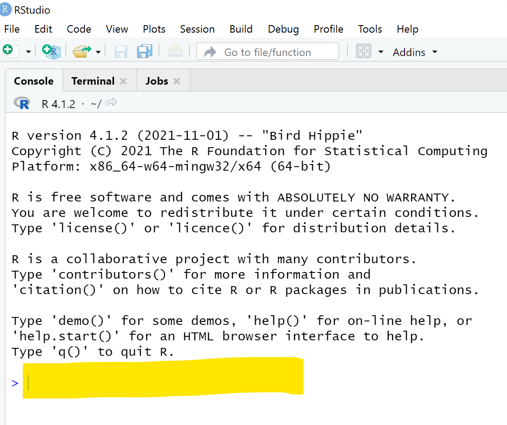

# Creating A Shiny Web App
### **Goal**: Publish an interactive web app to effectively visualize and analyze datasets common to academia.

## Table of Contents

## Why use Shiny?
Shiny is a framework for creating web applications using R code. Since Shiny is entirely based in R, users don't need front-end web dev knowledge to develop a complex app. Rather, with just a few lines of code, Shiny transforms your data into interactive charts and graphics with toggleable filters on a clean-looking website. 

The specific purpose of this tutorial is to leverage the power of Shiny to allow students and researchers to transform their simple findings into rich websites that displays data in a more interactive and accesible format.

## Getting Started:
### Things to Download:
As a refresher, the following will be needed to code with R and use the Shiny package:
+ [R](https://cran.r-project.org/bin/windows/base/)
+ [RStudio](https://www.rstudio.com/products/rstudio/download/)


### Setting Up the R Environment
After R and RStudio are succesfully installed, open up your RStudio console to install Shiny. Type in the following code line into the command line on the console:

```
install.packages("shiny")
```

{ width="400" style="display: block;marging: 0 auto" }
